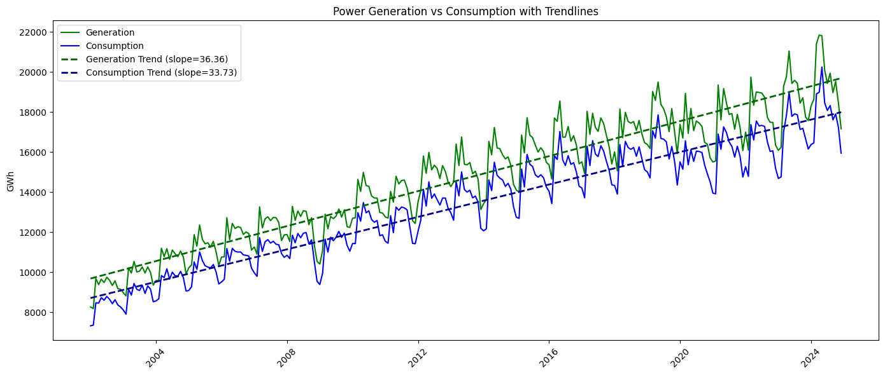
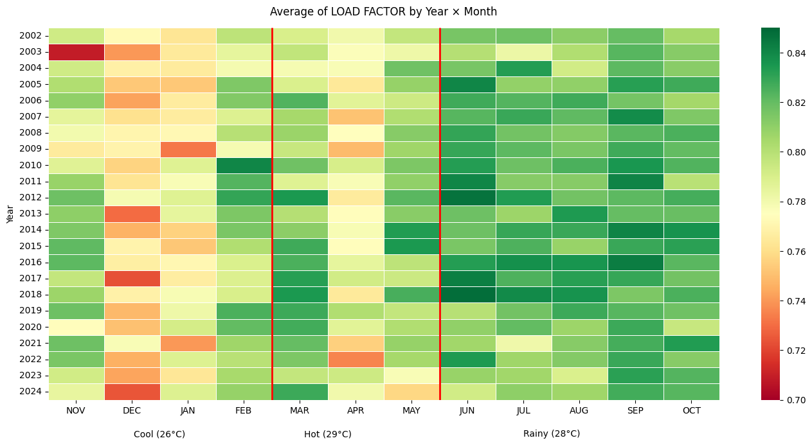
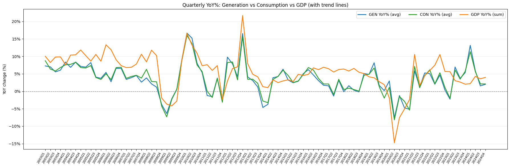
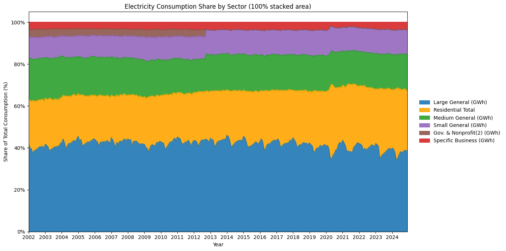
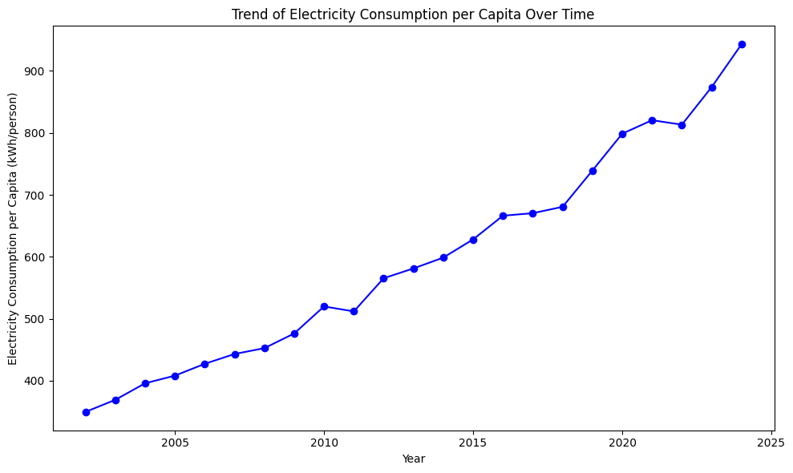
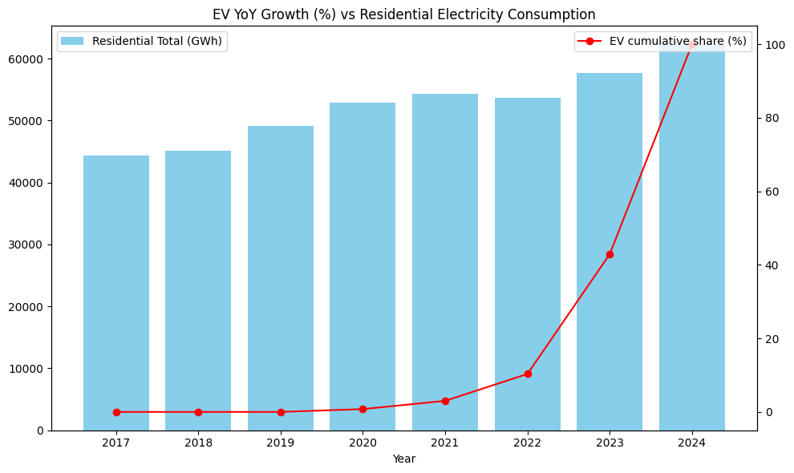
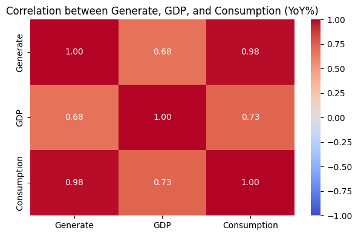
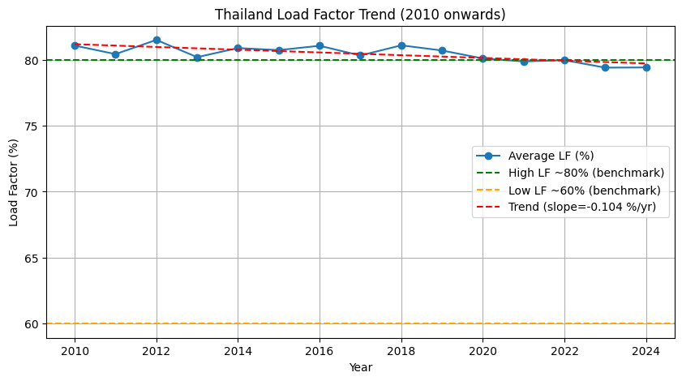
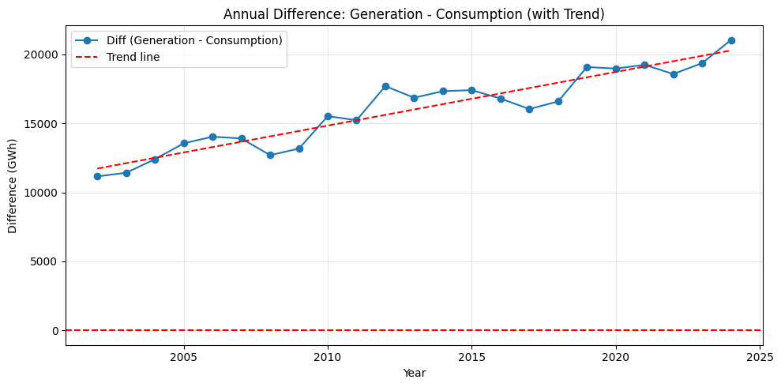
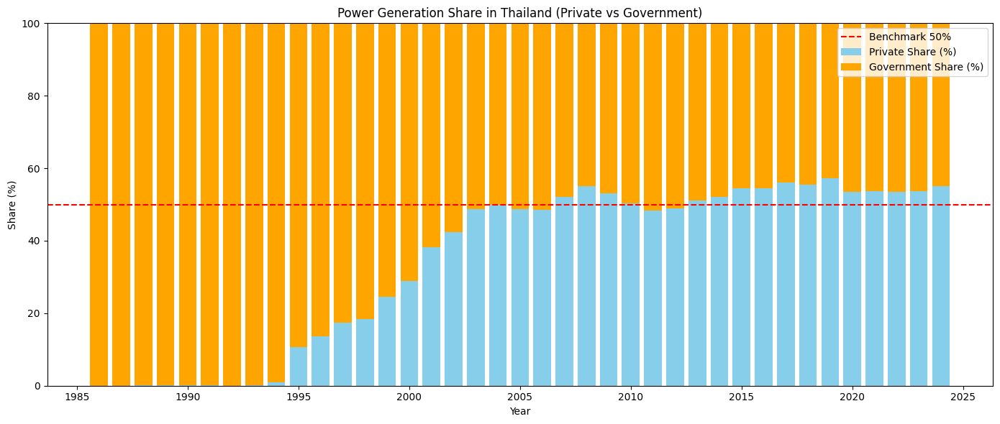

# รู้หมือไร่ค่าไฟแพงกว่าค่าข้าว
## Topic
ประเทศไทยจำเป็นต้องเพิ่มกำลังผลิตไฟฟ้าอีกหรือไม่?  

## Dataset
ข้อมูลการใช้ไฟฟ้า, การผลิตไฟฟ้า,จำนวนประชากร,จำนวนรถEV, GDP รายไตรมาส, อุณภูมิเฉลี่ยในแต่ละเดือน ของประเทศไทย ตั้งแต่ปี 2002-2024 จำนวน (276 Row, 28 Column)

---

## Introduction
แม้ประเทศไทยจะมีการขยายตัวทางเศรษฐกิจและความต้องการไฟฟ้าเพิ่มขึ้น 
แต่ข้อมูลหลายปีชี้ให้เห็นว่าปริมาณการผลิตมักสูงกว่าการใช้จริง เกิดคำถามสำคัญว่า
“ประเทศไทยจำเป็นต้องผลิตไฟฟ้าเพิ่มขึ้นจริงหรือไม่?”
การวิเคราะห์ dataset นี้จึงมุ่งตรวจสอบความสมดุลระหว่างการผลิตและการใช้ไฟฟ้า แนวโน้มส่วนเกิน (Oversupply) และปัจจัยที่ส่งผลต่อการใช้ไฟฟ้าในอนาคต 
เช่น รถยนต์ไฟฟ้า (EV), GDP, ประชากร, ฤดูกาล เพื่อให้ได้ข้อเท็จจริงที่สะท้อนความสมดุลของระบบพลังงานไทย

## Question 
### Q1.อุณหภูมิ, GDP, จำนวนประชากร, พฤติกรรมการใช้รถไฟฟ้า เป็นปัจจัยที่ส่งผลต่อการใช้งานไฟฟ้าหรือไม่ 

อากาศร้อนจัด ทำให้ไฟพุ่งสูงช่วงเย็น แต่ไม่ได้ใช้ต่อเนื่องทั้งวัน

เศรษฐกิจ (GDP) โตเมื่อไร การใช้ไฟก็โตตาม แต่ขึ้นลงน้อยกว่าเศรษฐกิจ

จำนวนคน ไม่ได้เป็นตัวแปรหลัก เพราะคนโตช้า แต่การใช้ไฟ “ต่อหัว” โตแรง

รถ EV เริ่มโตหลังปี 2022 แต่ยังไม่ใช่ตัวขับหลักในตอนนี้

➡️ สรุป: การใช้ไฟขึ้นกับพฤติกรรมและเทคโนโลยีใหม่ ๆ มากกว่าจำนวนคนเพียงอย่างเดียว

### Q2.แนวโน้มการผลิตไฟฟ้ามีความสอดคล้องต่อความต้องการหรือไม่

โครงสร้างความต้องการไฟฟ้ามีการเปลี่ยนแปลง โดยกลุ่ม Residential และ Small General ค่อย ๆ เพิ่มสัดส่วน ขณะที่ Large General ลดลง 
ทำให้เห็นถึงการขยายตัวของการใช้ไฟในภาคครัวเรือนและกิจการขนาดเล็กมากขึ้นตามเวลา 
อีกทั้งยังเห็นความหนาแน่นซ้ำ ๆ ของบางหมวดในฤดูกาลเดิม หรือความผันผวนผิดปกติในช่วงเหตุการณ์ใหญ่ 
เช่น โควิดและวิกฤตพลังงาน ซึ่งเมื่อสัดส่วน Residential สูงขึ้น จะทำให้การใช้ทำให้รูปทรงLoad factor เกิดทรงแหลมที่ชัดเจนขึ้น

ปริมาณการใช้ไฟฟ้าเฉลี่ยต่อคนต่อปี (kWh/คน/ปี) มีแนวโน้มการใช้ไฟเพิ่มขึ้นอย่างต่อเนื่อง และเมื่อเทียบกับไฟฟ้ารวมของประเทศในรูปแรกขยายตัวเช่นเดียวกัน 
จะเห็นได้ว่าการเติบโตของความต้องการไฟฟ้ามีความชันที่มากขึ้นมาจากการใช้ไฟฟ้าต่อคนที่สูงขึ้นซึ่งเป็นปัจจัยสำคัญที่ผลักดันให้ความต้องการไฟฟ้ารวมเพิ่มขึ้นอย่างชัดเจน และสะท้อนมาตรฐานชีวิตและการใช้ไฟพื้นฐานที่ขยายตัว

หลังปี 2022 จำนวนรถยนต์ไฟฟ้า (EV) เพิ่มขึ้นอย่างรวดเร็ว แต่ถ้าเทียบกับการใช้ไฟทั้งหมดของบ้านเรือนตอนนี้ EV 
ยังไม่ได้เป็นตัวการหลักที่ทำให้หน่วยไฟรวมพุ่งขึ้นในระยะสั้น อย่างไรก็ตาม แนวโน้ม EV ที่โตขึ้นอย่างรวดเร็วจะมีบทบาทมากขึ้นในระยะยาว 
จึงควรจัดให้การชาร์จเกิดขึ้นช่วงไฟไม่ค่อยถูกใช้ (เช่น ดึก ๆ) เพื่อลดการใช้ไฟพร้อมกันในช่วงเวลาเร่งด่วน และทำให้การใช้ไฟทั้งระบบไหลลื่นและคุ้มค่าขึ้น

การผลิตไฟฟ้าและการใช้ไฟฟ้าเคลื่อนไปด้วยกันสูงมาก สะท้อนว่าระบบผลิตตอบสนองต่อความต้องการได้ดี ขณะที่ความสัมพันธ์กับเศรษฐกิจอยู่ในระดับปานกลางถึงสูง
ไฟฟ้าจึงเดินตาม GDP แต่ไม่ใช่แบบหนึ่งต่อหนึ่ง ในมุมเชิงนโยบายควรใช้ GDP เป็นตัวบอกทิศทาง และบริหารกำลังผลิตโดยอิงกับรูปแบบการใช้ไฟและฤดูกาลควบคู่ 

ไทยผลิตไฟมากกว่าที่ใช้มาตลอด → ระบบมั่นคง แต่ก็มี “ไฟสำรองเกิน”
ยิ่งผลิตเกินมาก ค่าไฟก็อาจไม่ถูกลง เพราะต้องจ่ายค่าโรงไฟฟ้าที่ไม่ได้เดินเครื่องเต็มที่
ค่าเฉลี่ยการใช้ไฟต่อกำลังผลิต (Load Factor) ของไทยสูงกว่ามาตรฐานโลก แต่กำลังค่อย ๆ ลดลง

➡️ สรุป: เราไม่ได้ขาดไฟ แต่ผลิตเกินจนสิ้นเปลือง → ควรบริหารจัดการให้ยืดหยุ่นมากกว่าสร้างโรงไฟฟ้าเพิ่ม

### Q3.การผลิตไฟฟ้าในประเทศไทย มีสัดส่วนการผลิตจากภาครัฐและภาคเอกชน เป็นอัตราส่วนเป็นอย่างไร

กราฟแสดงค่า Load Factor ของประเทศไทยตั้งแต่ปี 2010 เป็นต้นมา พบว่าค่าเฉลี่ยอยู่ราว 80% และมีแนวโน้มลดลงเล็กน้อยตามเส้นแนวโน้ม

กราฟแสดงส่วนต่างระหว่างการผลิตไฟฟ้าและการใช้ไฟฟ้าประจำปี ตั้งแต่ปี 2002–2024 พบว่าส่วนต่างมีค่าเป็นบวกต่อเนื่อง และมีแนวโน้มเพิ่มขึ้นตามเส้นแนวโน้ม

กราฟแสดงสัดส่วนการผลิตไฟฟ้าของประเทศไทยตั้งแต่ปี 1985–2024 พบว่าสัดส่วนการผลิตจากภาคเอกชนเพิ่มขึ้นต่อเนื่องจนเกิน 50% ตั้งแต่ช่วงปี 2005 เป็นต้นมา ขณะที่สัดส่วนการผลิตจากภาครัฐลดลงตามลำดับ

## Conclusion
จากการวิเคราะห์ปัจจัยด้านความต้องการไฟฟ้า (Q1) พบว่าการใช้ไฟฟ้าได้รับอิทธิพลจากอุณหภูมิ การเติบโตทางเศรษฐกิจ และเทคโนโลยีใหม่ ๆ เช่น รถ EV ทำให้ความต้องการไฟฟ้าเติบโตต่อเนื่อง และส่งผลให้ต้องมีการผลิตกระแสไฟฟ้าเพิ่มมากขึ้น

เมื่อพิจารณาแนวโน้มการผลิตและการใช้ไฟฟ้า (Q2) พบว่าประเทศไทยผลิตไฟฟ้ามากกว่าความต้องการใช้อย่างต่อเนื่อง ซึ่งส่วนต่างระหว่างการผลิตและการใช้เพิ่มสูงขึ้น ขณะที่ค่า Load Factor แม้อยู่ระดับสูง (~80%) แต่มีแนวโน้มลดลง แสดงถึงการผลิตไฟฟ้าที่สูงมากเกินกว่าความต้องการใช้

และเมื่อพิจารณาในด้านสัดส่วนผู้ผลิต (Q3) พบว่า ภาคเอกชนมีบทบาทสำคัญมากขึ้น โดยตั้งแต่ปี 2005 เป็นต้นมา สัดส่วนการผลิตของเอกชนสูงกว่า 50% และยังคงมีแนวโน้มที่เพิ่มขึ้น ขณะที่สัดส่วนของภาครัฐลดลงตามลำดับ

ซึ่งจากข้อมูลข้างต้นแสดงให้เห็นว่าประเทศไทยมีไฟฟ้าสำรองเกินความจำเป็น (Oversupply) ซึ่งเกิดจากการขยายกำลังผลิตที่มากกว่าการเติบโตของความต้องการจริง ซึ่งอาจจะพิจารณาเรื่องการบริหารจัดการและเพิ่มประสิทธิภาพการใช้ไฟฟ้า มากกว่าการลงทุนสร้างโรงไฟฟ้าใหม่

##### ปล.การวิเคราะห์ข้างต้นเพื่อประกอบการศึกษาของวิชา DADS5001 สถาบันบัณฑิตพัฒนบริหารศาสตร์ (นิด้า) เท่านั้น

