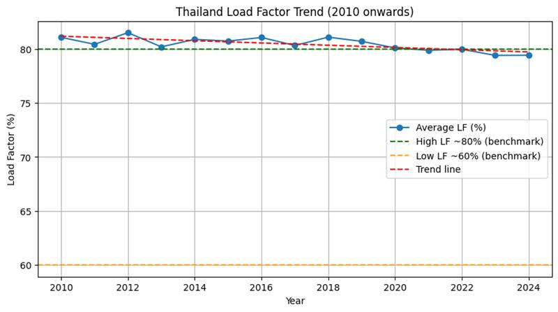

# รู้หมือไร่ค่าไฟแพงกว่าค่าข้าว
## Topic
ประเทศไทยจำเป็นต้องเพิ่มกำลังผลิตไฟฟ้าอีกหรือไม่?  

## Dataset
ข้อมูลการใช้ไฟฟ้า, การผลิตไฟฟ้า,จำนวนประชากร,จำนวนรถEV, GDP รายไตรมาส, อุณภูมิเฉลี่ยในแต่ละเดือน ของประเทศไทย ตั้งแต่ปี 2002-2024 จำนวน (276 Row, 28 Column)

---

## Introduction
แม้ประเทศไทยจะมีการขยายตัวทางเศรษฐกิจและความต้องการไฟฟ้าเพิ่มขึ้น 
แต่ข้อมูลหลายปีชี้ให้เห็นว่าปริมาณการผลิตมักสูงกว่าการใช้จริง เกิดคำถามสำคัญว่า
“ประเทศไทยจำเป็นต้องผลิตไฟฟ้าเพิ่มขึ้นจริงหรือไม่?”
การวิเคราะห์ dataset นี้จึงมุ่งตรวจสอบความสมดุลระหว่างการผลิตและการใช้ไฟฟ้า แนวโน้มส่วนเกิน (Oversupply) และปัจจัยที่ส่งผลต่อการใช้ไฟฟ้าในอนาคต 
เช่น รถยนต์ไฟฟ้า (EV), GDP, ประชากร, ฤดูกาล เพื่อให้ได้ข้อเท็จจริงที่สะท้อนความสมดุลของระบบพลังงานไทย

## Question 
### Q1.อุณหภูมิ, GDP, จำนวนประชากร, พฤติกรรมการใช้รถไฟฟ้า เป็นปัจจัยที่ส่งผลต่อการใช้งานไฟฟ้าหรือไม่

### Q2.แนวโน้มการผลิตไฟฟ้ามีความสอดคล้องต่อความต้องการหรือไม่

### Q3.การผลิตไฟฟ้าในประเทศไทย มีสัดส่วนการผลิตจากภาครัฐและภาคเอกชน เป็นอัตราส่วนเป็นอย่างไร

## Conclusion

