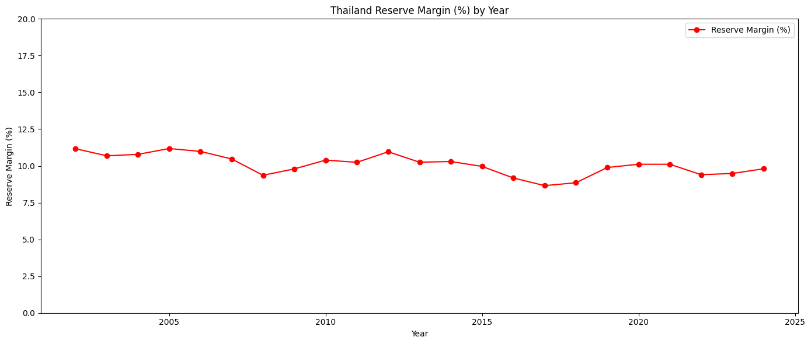

# รู้หมือไร่ค่าไฟแพงกว่าค่าข้าว
## Topic
ประเทศไทยจำเป็นต้องเพิ่มกำลังผลิตไฟฟ้าอีกหรือไม่?  

## Dataset
ข้อมูลการใช้ไฟฟ้า, การผลิตไฟฟ้า,จำนวนประชากร,จำนวนรถEV, GDP รายไตรมาส, อุณหภูมิเฉลี่ยในแต่ละเดือน ของประเทศไทย ตั้งแต่ปี 2002-2024 จำนวน (276 Row, 28 Column)

---

## Introduction
แม้ประเทศไทยจะมีการขยายตัวทางเศรษฐกิจและความต้องการไฟฟ้าเพิ่มขึ้น 
แต่ข้อมูลหลายปีชี้ให้เห็นว่าปริมาณการผลิตมักสูงกว่าการใช้จริง 
เกิดคำถามสำคัญว่า
“ประเทศไทยจำเป็นต้องผลิตไฟฟ้าเพิ่มขึ้นจริงหรือไม่?”
การวิเคราะห์ dataset นี้จึงมุ่งตรวจสอบความสมดุลระหว่างการผลิตและการใช้ไฟฟ้า แนวโน้มส่วนเกิน (Oversupply)
และปัจจัยที่ส่งผลต่อการใช้ไฟฟ้าในอนาคต เช่น รถยนต์ไฟฟ้า (EV), GDP, ประชากร, ฤดูกาล เพื่อให้ได้ข้อเท็จจริงที่สะท้อนความสมดุลของระบบพลังงานไทย

จากข้อมูลที่เรารวบรวมมาเราจะเห็นว่า:

เราจะพบว่าประเทศไทย มีการสำรองไฟฟ้าอยู่จริงและต่อเนื่องหลายปี โดยช่องว่างระหว่างการผลิตกับการใช้ จะสะท้อนให้เห็นถึงปริมาณการสำรองไฟฟ้า

โดยการสำรองไฟฟ้าของประเทศไทยจะอยู่ในช่วง 8-12%

## Question 
### Q1.แนวโน้มการผลิตไฟฟ้ามีความสอดคล้องต่อความต้องการหรือไม่
Load Factor (LF) = ปริมาณการใช้ไฟฟ้าเฉลี่ยทั้งเดือน เทียบกับ ยอดสูงสุดการใช้ไฟฟ้าของเดือน
  - Load Factor สูง (ค่ามาก): แสดงถึงการใช้ไฟฟ้าที่ สม่ำเสมอ และ มีประสิทธิภาพสูง เช่น การใช้ไฟฟ้าอย่างต่อเนื่องตลอดทั้งวัน ทำให้ต้นทุนการผลิตต่ำลงและใช้งานทรัพยากรได้เต็มศักยภาพ
  - Load Factor ต่ำ (ค่าน้อย): แสดงถึงการใช้ไฟฟ้าที่ ไม่สม่ำเสมอ มีช่วงเวลาที่ใช้ไฟฟ้าสูงมากๆ และช่วงเวลาที่ใช้ไฟน้อย ซึ่งถือว่า ไม่มีประสิทธิภาพ ทำให้ต้นทุนการผลิตไฟฟ้าสูงขึ้นและเสียค่าปรับจากผู้ให้บริการไฟฟ้าได้

โหลดแฟกเตอร์รายเดือนบอกถึงการประสิทธิภาพของการใช้ไฟฟ้า ถ้ามีสีเขียวมากแปลว่าใช้ไฟสม่ำเสมอทั้งวัน ซึ่งบ่งบอกได้ว่าในเดือนนั้นๆมีการใช้ไฟฟ้าที่ค่อนข้างมีประสิทธิภาพ แต่ในขณะเดียวกัน ถ้าแสดงเป็นสีแดง จะบ่งบอกว่าเกิดจากการใช้งาน Peak ที่มากเกินกว่าค่าเฉลี่ยอย่างเห็นได้ชัด ทำให้สามารถคาดคะเนได้ว่าในเดือนนั้นๆ อาจจะมีเหตุการณ์สำคัญในการใช้ไฟฟ้า อย่างการจัดกิจกรรมหรืองานเทศกาลได้

จากกราฟแสดงให้เห็นถึงการเปลี่ยนแปลงรายปีของการผลิตไฟฟ้า การใช้ไฟฟ้า และ GDP ในแต่ละไตรมาส เพื่อดูว่าความต้องการไฟฟ้าเดินไปในทิศทางเดียวกับเศรษฐกิจหรือไม่
ในช่วงปกติ GDP และไฟฟ้ามีทิศทางสอดคล้อง เศรษฐกิจเป็นตัวขับเคลื่อนหลักของการใช้ไฟฟ้าแต่บางช่วงหลัง 2015 เห็นว่า GDP โตเพียงเล็กน้อย แต่ไฟฟ้ายังโต (หรือตรงข้าม) แสดงว่ามี ปัจจัยอื่นร่วมด้วย เช่น พฤติกรรมการใช้พลังงาน, ประสิทธิภาพอุปกรณ์ไฟฟ้า และเทคโนโลยีใหม่ๆ แต่เราจะเห็นว่าในทางกลับกันตอนที่ GDP ตกฮวบแต่การใช้งานไฟฟ้าลดเพียงเล็กน้อย เนื่องจากไฟฟ้าเป็นสิ่งจำเป็นในชีวิตประจำวันและยังต้องใช้ต่อเนื่อง
อย่างเช่น เมื่อปี 2020 (โควิด-19): GDP ร่วงหนัก (เพราะท่องเที่ยว-บริการหายไป) แต่การใช้ไฟฟ้าลดลงไม่แรงเท่า เนื่องจากครัวเรือนใช้ไฟเพิ่มขึ้นด้วยซ้ำ (WFH, อยู่บ้านมากขึ้น)

### Q2. จำนวนประชากร,พฤติกรรมการใช้รถไฟฟ้า, GDP เป็นปัจจัยที่ส่งผลต่อการใช้งานไฟฟ้าหรือไม่ 

โครงสร้างความต้องการไฟฟ้ามีการเปลี่ยนแปลง โดยกลุ่ม Residential และ Small General ค่อย ๆ เพิ่มสัดส่วน ขณะที่ Large General ลดลง 
ทำให้เห็นถึงการขยายตัวของการใช้ไฟในภาคครัวเรือนและกิจการขนาดเล็กมากขึ้นตามเวลา 
อีกทั้งยังเห็นความหนาแน่นซ้ำ ๆ ของบางหมวดในฤดูกาลเดิม หรือความผันผวนผิดปกติในช่วงเหตุการณ์ใหญ่ 
เช่น ปี 2019-2020 โควิดและวิกฤตพลังงาน ซึ่งเมื่อสัดส่วน Residential สูงขึ้น จะทำให้การใช้ไฟเกิดทรงแหลมที่ชัดเจนขึ้น

เมื่อดูการใช้ไฟเฉลี่ยต่อคนต่อปีที่มีความชันสูงขึ้นต่อเนื่อง จะเห็นแนวโน้มการใช้ไฟที่เพิ่มขึ้นเรื่อย ๆ ซึ่งไปในทิศทางเดียวกับไฟฟ้ารวมของประเทศในรูปแรก 
นั่นคือ ความต้องการไฟฟ้าที่โตเร็วขึ้นมาจากการใช้ไฟฟ้าต่อคนที่สูงขึ้นซึ่งเป็นปัจจัยสำคัญที่ผลักดันให้ความต้องการไฟฟ้ารวมเพิ่มขึ้นอย่างชัดเจน 
และสะท้อนมาตรฐานชีวิตและการใช้ไฟพื้นฐานที่ขยายตัว

หลังปี 2022 จำนวนรถยนต์ไฟฟ้า (EV) เพิ่มขึ้นอย่างรวดเร็ว แต่ถ้าเทียบกับการใช้ไฟทั้งหมดของบ้านเรือนตอนนี้ EV ยังไม่ได้เป็นตัวการหลักที่ทำให้หน่วยไฟรวมพุ่งขึ้นในระยะสั้น แต่จะมีบทบาทมากขึ้นในระยะยาว 

การผลิตไฟฟ้าและการใช้ไฟฟ้ามีความสัมพันธ์กันสูงมาก สะท้อนว่าระบบผลิตตอบสนองต่อความต้องการได้ดี ขณะที่ความสัมพันธ์กับเศรษฐกิจอยู่ในระดับปานกลางถึงสูง 
ไฟฟ้าจึงเดินตาม GDP แต่ไม่ใช่แบบหนึ่งต่อหนึ่ง ในมุมเชิงนโยบายควรใช้ GDP เป็นตัวบอกทิศทาง และบริหารกำลังผลิตโดยอิงกับรูปแบบการใช้ไฟและฤดูกาลควบคู่

➡️ โดยรวมแล้วความต้องการไฟฟ้าถูกขับเคลื่อนจากโครงสร้างผู้ใช้และพฤติกรรมมากกว่าจำนวนโรงไฟฟ้า

### Q3.การผลิตไฟฟ้าและการจัดสรรพลังงานในประเทศไทยมีแนวโน้มเป็นอย่างไร

กราฟแสดงค่า Load Factor ของประเทศไทยตั้งแต่ปี 2010 เป็นต้นมา พบว่าค่าเฉลี่ยอยู่ราว 80% และมีแนวโน้มลดลง

กราฟแสดงส่วนต่างระหว่างการผลิตไฟฟ้าและการใช้ไฟฟ้าประจำปี ตั้งแต่ปี 2002–2024 พบว่าส่วนต่างมีค่าเป็นบวกต่อเนื่อง และมีแนวโน้มเพิ่มขึ้น

กราฟแสดงสัดส่วนการผลิตไฟฟ้าของประเทศไทยตั้งแต่ปี 1985–2024 พบว่าสัดส่วนการผลิตจากภาคเอกชนเพิ่มขึ้นต่อเนื่องจนเกิน 50% ตั้งแต่ช่วงปี 2005 เป็นต้นมา ขณะที่สัดส่วนการผลิตจากภาครัฐลดลงตามลำดับ

## Conclusion

   ซึ่งจากข้อมูลแสดงให้เห็นว่าประเทศไทยมีการผลิตไฟฟ้ามากกว่าความต้องการ (Oversupply) ซึ่งอาจเกิดจากการขยายกำลังผลิตที่มากกว่าการเติบโตของความต้องการจริง 
เมื่อพิจารณาจากข้อมูลดังกล่าว -ต้นทุนในส่วนของการผลิตจะสูงขึ้น 
                        -แนวโน้มของอัตราส่วนระหว่างการผลิตไฟฟ้าในภาคเอกชนมีแนวโน้มเพิ่มสูงขึ้น 
   จากข้อมูลนี้ประเทศไทยอาจจะมีการเรียกเก็บค่าใช้ไฟฟ้าเพิ่มขึ้นอย่างต่อเนื่องได้ในอนาคต

##### ปล.การวิเคราะห์ข้างต้นเพื่อประกอบการศึกษาของวิชา DADS5001 สถาบันบัณฑิตพัฒนบริหารศาสตร์ (นิด้า) เท่านั้น
